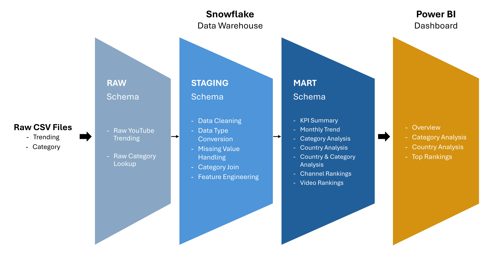
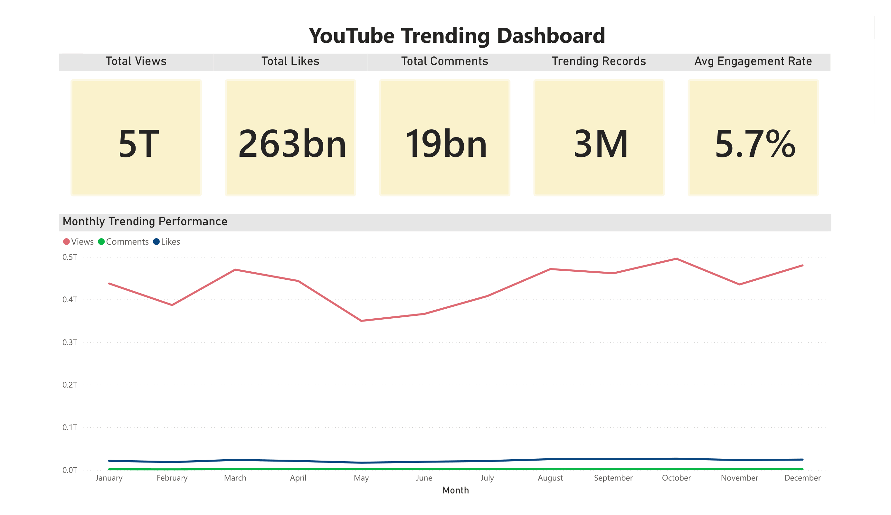
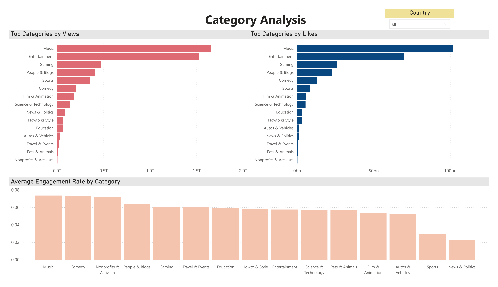
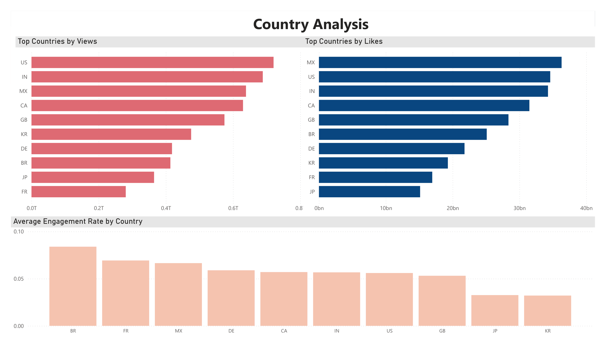
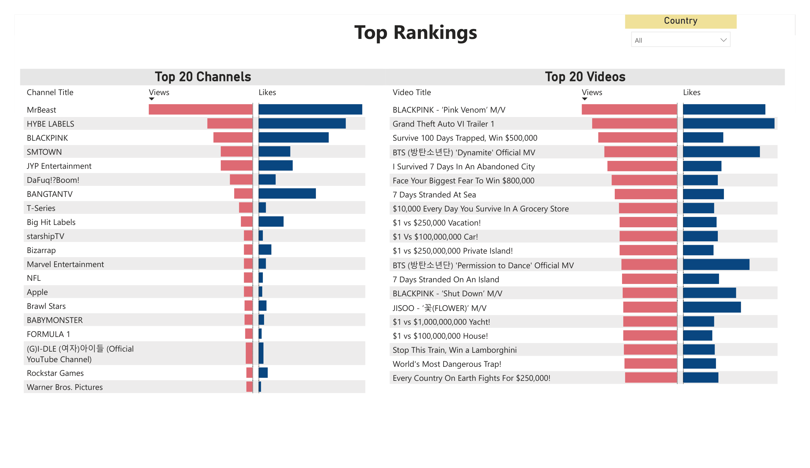

# YouYube Trending Analytics

## 1. Project Overview

### Business Problem

YouTube generates millions of trending video records across different countries, categories, and channels. However, raw trending data alone provides limited insights into overall performance, audience engagement and regional content preferences.
This project transforms raw YouTube trending datasets into an analytics-ready data warehouse using Snowflake and delivers an interactive Power BI dashboard to support data-driven exploration of content trends.

### Objective

- Build a layered Snowflake data warehouse (RAW -> STAGING -> MART)
- Clean and transform raw YouTube trending datasets using SQL
- Create analytics-ready views for reporting
- Develop an interactive Power BI dashboard to analyse
    - Overall platform performance
    - Category Analysis
    - Country Anlaysis
    - Top channels and videos

## 2. Dataset

**Source**

- [Kaggle - YouTube Trending Video Dataset](https://www.kaggle.com/datasets/rsrishav/youtube-trending-video-dataset)

**Files** 

- **Trending (.csv):** Video-level metadata collected from YouTube across 10 countries, covering August 2020 to April 2024
- **Category (.json):** Category lookup data mapping each category ID to its corresponding category title

## 3. Project Workflow



*Figure 1. Overall Workflow used in this project*

## 4. SQL Pipeline

The project follows a layered SQL pipeline in Snowflake to transform raw YouTube data into analytics-ready views for Power BI reporting.

### RAW Schema

- Loaded original YouTube Trending CSV and Category JSON files into Snowflake.
- Added a `Country` column during data ingestion.
- Stored source data.

### STAGING Schema

- Cleaned and standardised raw data.
- Converted data types and handled missing values.
- Joined trending data with category lookup data.
- Created derived features for downstream analysis.

### MART Schema

- **KPI Summary** – Overall platform metrics.
- **Monthly Trend** – Monthly views, likes, comments, and engagement trends.
- **Category Analysis** – Performance comparison across content categories.
- **Country Analysis** – Country-level performance metrics.
- **Country-Category Analysis** – Category performance within each country.
- **Channel Ranking** – Top-performing channels.
- **Video Ranking** – Top-performing videos.

## 5. Dashboard Preview



*Figure 2. Overview Dashboard presenting key KPIs and monthly YouTube trending performance*



*Figure 3. Category-level analysis comparison of views, likes and average engagement rate with country filtering*



*Figure 4. Country-level analysis comparison of views, likes and average engagement rate across 10 countries*



*Figure 5. Interactive ranking tables highlighting the top-performing channels and videos with country filtering* 

## 6. Key Insights

- **'Music'** was the strongest category overall, ranking first in total views, likes and average engagement rate.
- **'Entertainment'** was the second-strongest category, but it's average engagement rate was lower than Music, Gaming, People & Blogs and Comedy.
- **The United States** had the highest total views, while **Mexico** recorded the highest total likes.
- **Brazil** had the highest average engagement rate, while **Japan** and **Korea** showed the lowest engagement rates in the top country comparison.
- Top rankings were concentrated among major creators and entertainment channels.

## 7. Tech Stack

- **Snowflake** – Data warehouse, schema design, SQL transformations, and analytics views
- **SQL** – Data cleaning, aggregation, feature engineering, and mart creation
- **Power BI** – Interactive dashboard development and data visualisation
- **GitHub** – Project documentation and version control

## 8. Repository Structure

```text
youtube_trending_analytics/
├── images
│   ├── category_analysis.png
│   ├── country_analysis.png
│   ├── top_rankings.png
│   ├── trending_dashboard.png
│   └── youtube_workflow.png
├── powerbi
│   └── youtube_trending.pbix
├── README.md
└── sql
    ├── 01_setup.sql
    ├── 02_staging_table.sql
    ├── 03_mart_tables.sql
    └── 04_analysis_queries.sql
```

## 9. Future Improvements

- Connect Power BI directly to Snowflake instead of using exported mart files.
- Add more interactive filters such as category and date range slicers.
- Include annual or seasonal trend analysis.
- Build additional views to compare regional differences in trending behaviour.